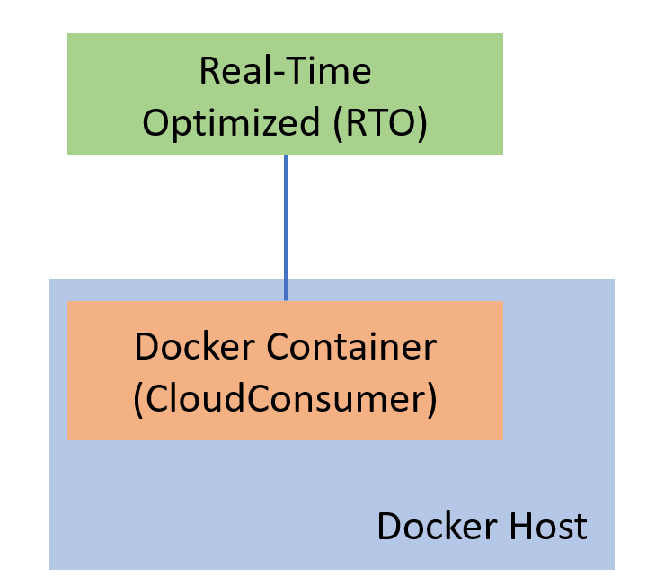

# How to deploy and run Real-Time Java application with Maven in Docker
- version: 1.1.0
- Last update: December 2021
- Environment: Windows, Linux
- Compiler: Java and Maven
- Prerequisite: [Demo prerequisite](#prerequisite)


**As of December 2021**: There is a new serious vulnerability was identified impacting the Apache Log4j utility ([CVE-2021-44228](https://cve.mitre.org/cgi-bin/cvename.cgi?name=CVE-2021-44228)). The issue is fixed in Apache Log4j version **2.15**. Please see more detail from the [Apache Log4j Security Vulnerabilities](https://logging.apache.org/log4j/2.x/security.html) page.

## <a id="Introduction"></a>Introduction

[Refinitiv Real-Time SDK (Java Edition)](https://developers.refinitiv.com/en/api-catalog/refinitiv-real-time-opnsrc/rt-sdk-java) (RTSDK, formerly known as Elektron SDK) is a suite of modern and open source APIs that aim to simplify development through a strong focus on ease of use and standardized access to a broad set of Refinitiv proprietary content and services via the proprietary TCP connection named RSSL and proprietary binary message encoding format named OMM Message.  The SDK supports Java build automation tools such as [Apache Maven](https://maven.apache.org/) and [Gradle](https://gradle.org/) which helps Java developers build RTSDK Java application, manage its dependencies, and better collaboration in the team.

[Docker](https://www.docker.com/) is an open containerization platform for developing, testing, deploying, and running any software application. In Docker, the applications are presented as lightweight, portable, and self-sustaining containers which can be simultaneously run in a loosely isolated and virtual environment on a given host. Developers can use Docker to automate repetitive chores, such as setting up and configuring controlled development environments. Each environment or container has its resources that are independent of other containers. Numerous containers of separate applications are running on completely different stacks. Therefore, developers can avoid common problems, such as run-time library conflicts, and unsupported environments, and focus totally on developing software. Moreover, they can simply delete the containers without any footprints left on the host machine.

My colleague's [Deploy and Run Refinitiv Real-Time SDK in Docker](https://developers.refinitiv.com/en/article-catalog/article/deploy-and-run-elektron-sdk-docker) article already shows how to deploy and run RTSDK applications in the Docker by let Docker downloads the SDK source code from [GitHub](https://github.com/Refinitiv/Real-Time-SDK), and build the SDK library and example applications from scratch. This scenario is suitable for developers who new to the SDK. 

This project aims for helping Java developers who already familiar with Maven to use the Java Builder container to resolve RTSDK Java library dependencies dynamically with Maven, then builds and runs the real-time applications in the container(s). This scenario is suitable for the Java developer team who already uses Maven in their project to set up a Development and Build environment via Docker.  

Note: Please note that the Refinitiv Real-Time SDK isn't qualified on the Docker platform. This article and example projects aim for Development and Testing purposes only. If you find any problems while running it on the Docker platform, the issues must be replicated on bare metal machines before contacting the helpdesk support.

## <a id="rebrand"></a>IMPORTANT Re-branding Announcement: 

Starting with version RTSDK 2.0.0.L1 (same as EMA/ETA 3.6.0.L1), there are namespace changes and library name changes. Please note that all interfaces remain the same as prior releases of RTSDK and Elektron SDK and will remain fully wire compatible. Along with the RTSDK 2.X version, a [REBRAND.md](https://github.com/Refinitiv/Real-Time-SDK/blob/master/REBRAND.md) is published to detail the impact on existing applications and how to quickly adapt to the re-branded libraries. Existing applications will continue to work indefinitely as-is.  Applications should be proactively rebranded to be able to utilize new features, security updates or fixes post 2.X release. Please see [PCN](https://my.refinitiv.com/content/mytr/en/pcnpage/12072.html?_ga=2.103280071.632863608.1606731450-325683966.1598503157) for more details on support. 


## <a id="rtsdk_java_maven"></a>RTSDK Java with Maven

The Refinitiv Real-Time SDK Java is now available in [Maven Central Repository](https://search.maven.org/). You can define the following dependency in Maven's pom.xml file to let Maven automatically download the [EMA Java library](https://search.maven.org/artifact/com.refinitiv.ema/ema/) and [ETA Java library](https://search.maven.org/artifact/com.refinitiv.eta/eta) for the application.


For more detail regarding how to setup RTSDK Java project with Maven, please see [How to Set Up Refinitiv Real-Time SDK Java Application with Maven](https://developers.refinitiv.com/en/article-catalog/article/how-to-set-up-refinitiv-real-time-sdk-java-application-with-mave) article and [GitHub Project](https://github.com/Refinitiv-API-Samples/Article.RTSDK.Java.MavenHowTo) pages

Note: 
- This article is based on EMA Java version 3.6.1 L1 (RTSDK Java Edition 2.0.1 L1). 

## <a id="simple_docker_consumer"></a>Simple EMA Java Consumer on Docker

Let's start with a simple EMA Java Consumer application that connects and consume data from Refinitiv Real-Time - Optimized (RRTO) on the Cloud. The application *CloudConsumer* is based on the EMA Java Consumer *ex450_MP_QueryServiceDiscovery* example application. 



### Project Maven file

The application project is in Maven project layout and the Maven *pom.xml* file is the following:

```
<?xml version="1.0" encoding="UTF-8"?>

<project xmlns="http://maven.apache.org/POM/4.0.0" xmlns:xsi="http://www.w3.org/2001/XMLSchema-instance"
         xsi:schemaLocation="http://maven.apache.org/POM/4.0.0 http://maven.apache.org/xsd/maven-4.0.0.xsd">
    <modelVersion>4.0.0</modelVersion>

    <groupId>com.refinitiv.ema</groupId>
    <artifactId>cloud_consumer</artifactId>
    <version>1.0</version>

    <name>cloud_consumer</name>

    <properties>
        <project.build.sourceEncoding>UTF-8</project.build.sourceEncoding>
        <maven.compiler.source>1.8</maven.compiler.source>
        <maven.compiler.target>1.8</maven.compiler.target>
        <rtsdk.version>3.6.1.0</rtsdk.version>
    </properties>

    <dependencies>
        <!-- RTSDK EMA Java-->
        <dependency>
            <groupId>com.refinitiv.ema</groupId>
            <artifactId>ema</artifactId>
            <version>${rtsdk.version}</version>
        </dependency>
    </dependencies>

    
    <build>
        <plugins>
            <plugin>
                <groupId>org.apache.maven.plugins</groupId>
                <artifactId>maven-assembly-plugin</artifactId>
                <executions>
                    <execution>
                        <phase>package</phase>
                        <goals>
                            <goal>single</goal>
                        </goals>
                        <configuration>
                            <archive>
                                <manifest>
                                    <mainClass>
                                        com.refinitiv.ema.cloud.CloudConsumer 
                                    </mainClass>
                                </manifest>
                            </archive>
                            <descriptorRefs>
                                <descriptorRef>jar-with-dependencies</descriptorRef>
                            </descriptorRefs>
                        </configuration>
                    </execution>
                </executions>
            </plugin>
        </plugins>
    </build>
    
</project>
```

The above Maven *pom.xml* file resolves the RTSDK Java library and dependencies from Maven Central, and then builds the application and the RTSDK library into a single-all-dependencies jar file named *cloud_consumer-1.0-jar-with-dependencies.jar*.  Please see [How to Set Up Refinitiv Real-Time SDK Java Application with Maven](https://developers.refinitiv.com/en/article-catalog/article/how-to-set-up-refinitiv-real-time-sdk-java-application-with-mave) article about the pom.xml setting for the RTSDK Java library.

### Project Docker file

The [Dockerfile](https://docs.docker.com/engine/reference/builder/) for building this simple application's image is the following:

```
# Maven 
FROM maven:3.8.1-openjdk-11-slim AS builder
WORKDIR /app
COPY pom.xml .
RUN mvn -e -B dependency:resolve
COPY src ./src
RUN mvn clean -e -B package

# RTSDK Java
FROM openjdk:11-jre-slim-buster
WORKDIR /app
COPY --from=builder /app/target/cloud_consumer-1.0-jar-with-dependencies.jar .
COPY EmaConfig.xml .
COPY etc ./etc
COPY run.sh ./run.sh
# Use shell script to support passing application name and its arguments to the ENTRYPOINT
ENTRYPOINT [ "./run.sh" ]
```

This *Dockerfile* utilizes the best practices from [Intro Guide to Dockerfile Best Practices](https://www.docker.com/blog/intro-guide-to-dockerfile-best-practices/) blog post. It uses multi-stage builds to separate the Maven build process from the RTSDK Java application run process. 

You may notice that the Dockerfile calls the *run.sh* script with ```ENTRYPOINT``` instruction instead calls ```java``` command directly. The reason is the CloudConsumer application requires the RRTO credentials information input via the command line arguments  (```-username```, ```-password```, ```-clientId```, etc ), so we create the *run.sh* shell script to run the cloud_consumer-1.0-jar-with-dependencies.jar file and accept the command line arguments for Docker. 

The content of *run.sh* script is the following:

```
#!/bin/sh

java -jar ./cloud_consumer-1.0-jar-with-dependencies.jar "$@"
```

**Update: September 2021.**

You do not need the *run.sh* script to run the application in a Docker container. You can set both ```ENTRYPOINT``` and ```CMD``` instructions instead.

```
# Maven 
FROM maven:3.8.1-openjdk-11-slim AS builder
WORKDIR /app
COPY pom.xml .
RUN mvn -e -B dependency:resolve
COPY src ./src
RUN mvn clean -e -B package

# RTSDK Java
FROM openjdk:11-jre-slim-buster
WORKDIR /app
COPY --from=builder /app/target/cloud_consumer-1.0-jar-with-dependencies.jar .
COPY EmaConfig.xml .
COPY etc ./etc
#COPY run.sh ./run.sh #comment the COPY command
ENTRYPOINT ["java", "-jar", "./cloud_consumer-1.0-jar-with-dependencies.jar"]
CMD ["-ric", "/EUR="]
```

Then you can pass the RRTO credentials and the application command line arguments after the ```docker run``` command as usual.

## <a id="advance_docker_applications"></a>Advance EMA Consumer and IProvider applications on Docker

The next example is replicating the EMA Consumer and Interactive-Provider applications projects. The Consumer and Provider applications are developed and maintained in a different project, each project has its Maven dependencies that match requirements of Consumer and Provider tasks/requirements.  

We will run the Consumer and Provider applications in separate Docker containers to simulate the real-life scenario that the applications run in a different machine (or even network).


### Project Maven file

The IProvider application is based on EMA Java Interactive-Provider ex200_MP_Streaming example with additional logic to display application message with the [Cowsay](https://github.com/ricksbrown/cowsay) library (if you do not know [what cowsay is](https://en.wikipedia.org/wiki/Cowsay) is), so we define the Cowsay dependency in Maven pom.xml too.

```
<?xml version="1.0" encoding="UTF-8"?>
<project xmlns="http://maven.apache.org/POM/4.0.0"
         xmlns:xsi="http://www.w3.org/2001/XMLSchema-instance"
         xsi:schemaLocation="http://maven.apache.org/POM/4.0.0 http://maven.apache.org/xsd/maven-4.0.0.xsd">
    <modelVersion>4.0.0</modelVersion>

    <groupId>com.refinitiv</groupId>
    <artifactId>IProvider</artifactId>
    <version>1.0</version>

    <name>IProvider</name>

    <properties>
        <maven.compiler.source>8</maven.compiler.source>
        <maven.compiler.target>8</maven.compiler.target>
        <rtsdk.version>3.6.1.0</rtsdk.version>
        <cowsay.version>1.1.0</cowsay.version>
    </properties>

    <dependencies>
        <!-- RTSDK -->
       ...
        <!-- https://mvnrepository.com/artifact/com.github.ricksbrown/cowsay -->
        <dependency>
            <groupId>com.github.ricksbrown</groupId>
            <artifactId>cowsay</artifactId>
            <version>${cowsay.version}</version>
            <classifier>lib</classifier>
        </dependency>
    </dependencies>

    <!-- Build single-all-dependencies jar file named IProvider-1.0-jar-with-dependencies.jar -->
    <build>
        ...
    </build>

</project>
```

The Consumer application is based on EMA Java Consumer ex200_MP_Streaming example with additional logic to print/log application and EMA Java API messages with [Apache Log4j](https://logging.apache.org/log4j/2.x/) library. Please refer to [Enterprise Message API Java with Log4j article](https://developers.refinitiv.com/en/article-catalog/article/how-integrate-elektron-message-api-java-log4j-logging-framework-using-maven)  for more detail about EMA Java application and Log4j integration. 

The pom.xml file for the Consumer project is the following:

```
<?xml version="1.0" encoding="UTF-8"?>
<project xmlns="http://maven.apache.org/POM/4.0.0"
         xmlns:xsi="http://www.w3.org/2001/XMLSchema-instance"
         xsi:schemaLocation="http://maven.apache.org/POM/4.0.0 http://maven.apache.org/xsd/maven-4.0.0.xsd">
    <modelVersion>4.0.0</modelVersion>

    <groupId>com.refinitiv</groupId>
    <artifactId>IProvider</artifactId>
    <version>1.0</version>

    <name>IProvider</name>

    <properties>
        <maven.compiler.source>8</maven.compiler.source>
        <maven.compiler.target>8</maven.compiler.target>
        <rtsdk.version>3.6.1.0</rtsdk.version>
        <log4j.version>2.15.0</log4j.version>
    </properties>

    <dependencies>
        <!-- RTSDK -->
       ...
       <dependency>
            <groupId>com.refinitiv.eta.valueadd</groupId>
            <artifactId>etaValueAdd</artifactId>
            <version>${rtsdk.version}</version>
            <exclusions>
                <exclusion>
                    <groupId>org.slf4j</groupId>
                    <artifactId>slf4j-jdk14</artifactId>
                </exclusion>
            </exclusions>
        </dependency>

        <!-- log4j -->
        <dependency>
            <groupId>org.apache.logging.log4j</groupId>
            <artifactId>log4j-api</artifactId>
            <version>${log4j.version}</version>
        </dependency>
        <dependency>
            <groupId>org.apache.logging.log4j</groupId>
            <artifactId>log4j-core</artifactId>
            <version>${log4j.version}</version>
        </dependency>

        <dependency>
            <groupId>org.apache.logging.log4j</groupId>
            <artifactId>log4j-slf4j-impl</artifactId>
            <version>${log4j.version}</version>
        </dependency>
        
    </dependencies>

    <!-- Build a single-all-dependencies jar file named Consumer-1.0-jar-with-dependencies.jar  -->
    <build>
        ...
    </build>

</project>
```

### Consumer Log4j configuration file

The Consumer application's *log4j2.xml* configuration file is available in the Consumer project's *resources* folder. The configurations set the Consumer application to log messages with the following logic:
- Application log message: Log messages to both console and a log file in */logs/consumer_log4j.log* location
- EMA log message: log messages to a log file in */logs/ema_log4j.log* location

So, we need to map the */log/* folder inside the containers to the host machine directory as well.

```
<?xml version="1.0" encoding="UTF-8"?>
<Configuration status="INFO">

    <Appenders>
        <Console name="LogToConsole" target="SYSTEM_OUT">
            <PatternLayout pattern="%d Class name-%C Message-%m%n"/>
        </Console>
        <File name="emaLogFile" fileName="/logs/ema_log4j.log">
            <PatternLayout>
                <Pattern>%d LEVEL-%-5p Thread-[%t]  Method-%M()   Class name-%C   Message-%m%n
                </Pattern>
            </PatternLayout>
        </File>
        <File name="consumerLogFile" fileName="/logs/consumer_log4j.log">
            <PatternLayout>
                <Pattern>%d{HH:mm:ss.SSS} [%t] %-5level %logger{36} - %msg%n
                </Pattern>
            </PatternLayout>
        </File>
    </Appenders>

    <Loggers>
        <!-- avoid duplicated logs with additivity=false -->
        <Logger name="com.refinitiv.ema" level="trace" additivity="false">
            <AppenderRef ref="emaLogFile"/>
        </Logger>
        <Logger name="com.refinitiv.ema.consumer" level="info" additivity="false">
            <AppenderRef ref="LogToConsole"/>
            <AppenderRef ref="consumerLogFile"/>
        </Logger>
    </Loggers>
</Configuration>
```

### Projects Docker files

The *Dockerfile-provider* for building the Provider application's Image is almost identical to the CloudConsumer's Dockerfile except it called ```java -jar ./IProvider-1.0-jar-with-dependencies.jar``` command with the ```CMD``` instruction instead:

```
## Dockerfile-provider
# Maven 
FROM maven:3.8.1-openjdk-11-slim AS builder
WORKDIR /app
COPY pom.xml .
RUN mvn -e -B dependency:resolve
COPY src ./src
RUN mvn clean -e -B package

# RTSDK Java
FROM openjdk:11-jre-slim-buster
WORKDIR /app
COPY --from=builder /app/target/IProvider-1.0-jar-with-dependencies.jar .
COPY EmaConfig.xml .
COPY etc ./etc
# run IProvider-1.0-jar-with-dependencies.jar with CMD
CMD ["java", "-jar", "./IProvider-1.0-jar-with-dependencies.jar"]
```

The *Dockerfile-consumer* for building the Consumer application's Image adds the *resource* folder with *log4j2.xml* Log4j configuration file into the container for Log4j setting during runtime:

```
## Dockerfile-consumer
# Maven 
FROM maven:3.8.1-openjdk-11-slim AS builder
WORKDIR /app
COPY pom.xml .
RUN mvn -e -B dependency:resolve
COPY src ./src
RUN mvn clean -e -B package

# RTSDK Java
FROM openjdk:11-jre-slim-buster
WORKDIR /app
COPY --from=builder /app/target/Consumer-1.0-jar-with-dependencies.jar .
COPY EmaConfig.xml .
COPY etc ./etc
COPY resources ./resources
# run Consumer-1.0-jar-with-dependencies.jar with CMD
CMD ["java", "-jar","-Dlog4j.configurationFile=./resources/log4j2.xml", "./Consumer-1.0-jar-with-dependencies.jar"]
```

Since we need to run both Provider and Consumer Containers simultaneously, so we use the [Docker-Compose](https://docs.docker.com/compose/) tool to build/run multi-container Docker applications. We define the containers configurations in the [docker-compose.yml (version 3)](https://docs.docker.com/compose/compose-file/compose-file-v3/) configuration file. Please note that the file is in [YAML](https://yaml.org/) file format. 

The consumer service for Consumer contains is mapped the current *log* folder to the container working directory's */logs* folder with the [volumes configuration](https://docs.docker.com/compose/compose-file/compose-file-v3/#volumes) to store the EMA and Consumer application log files in the Host machine. 

```
version: "3.9"
services: 
    provider:
        image: developers/provider
        build: 
            context: ./IProvider
            dockerfile: Dockerfile-provider
    consumer:
        image: developers/consumer
        build: 
            context: ./Consumer
            dockerfile: Dockerfile-consumer
        depends_on: 
            - provider
        volumes: 
            - ./Consumer/logs:/logs
```

## <a id="application_files"></a>Project Application Files
This example project contains the following files and folders
1. *simpleCloudConsumer/* folder: The simple EMA Java Consumer on Docker project, contains source code, configurations, Maven and Docker files.
2. *advanceExamples/IProvider*: The IProvider project folder for the advance use case, contains source code, configurations, Maven, and Docker files.
3. *advanceExamples/Consumer*: The Consumer project folder for the advance use case, contains source code, configurations, Maven, and Docker files.
4. *advanceExamples/docker-compose.yml*: The advance use case docker-compose configuration file.
8. *.vscode*: Project's [VSCode](https://code.visualstudio.com/) extra configurations.
6. *images/*: Project images folder.
7. *diagram.pptx*: Project diagram file.
8. *LICENSE.md*: Project's license file.
9. *README.md*: Project's README file.

## <a id="prerequisite"></a>Demo prerequisite
This example requires the following dependencies software and libraries.
1. Oracle/Open JDK 8 or Oracle JDK 11.
2. [Apache Maven](https://maven.apache.org/) project management and comprehension tool.
3. Internet connection. 
4. [Docker Desktop/Engine](https://docs.docker.com/get-docker/) version 20.10.x and [Docker-Compose](https://docs.docker.com/compose/install/) version 1.29.x
5. Access to the Refinitiv Refinitiv Data Platform and Refinitiv Real-Time - Optimized. (for the *CloudConsumer.java* example only)

Please contact your Refinitiv's representative to help you to access the Refinitiv Real-Time Distribution System, or RDP account, and services. 

*Note:* 
The RTSDK Java version 2.0.1 L1 (EMA Java 3.6.1) supports Oracle JDK versions 8, 11, and Open JDK version 8. If you are using other versions of RTSDK Java, please check the SDK's [README.md](https://github.com/Refinitiv/Real-Time-SDK/blob/master/Java/README.md) file regarding the supported Java version.

## <a id="running"></a>Running the demo applications

#### Running the CloudConsumer Example

Please note that since RTSDK 1.5.1 (EMA and ETA Java API version 3.5.1), the SDK does not require the Keystore file (.jsk) to connect to the Refinitiv Real-Time - Optimized HTTPS/ENCRYPTED connection anymore. However, if you need to use the Keystore file, please see the step-by-step guide from the [Building a Keystore file to be used with an HTTPS (or ENCRYPTED) connection type for real-time Java-based APIs](https://developers.refinitiv.com/en/article-catalog/article/building-keystore-file-be-used-https-or-encrypted-connection-type-real-time-java-based-apis) article first and store it in the Host directory, then pass it to Docker with ```-v``` Docker run parameter.

Firstly, open the project folder in the command prompt and go to the *simpleCloudConsumer* subfolder. Next, run the [Docker build](https://docs.docker.com/engine/reference/commandline/build/) command to build the Docker Image name *developers/cloudconsumer*:

```
$>simpleCloudConsumer> docker build . -t developers/cloudconsumer
```

Then Docker will start building the application image. You can use ```docker images``` command to check the image detail.


To start and run the cloudconsumer container, run the following [Docker run](https://docs.docker.com/engine/reference/run/) command in a command prompt.

```
$>simpleCloudConsumer> docker run --name <Container Name> -it developers/cloudconsumer -username <machine-id> -password <password> -clientId <app_key> -itemName <Request item name (optional)>
```
The result is the following:

```
#Docker result

Services :
    Service :
        Provider : aws
        Transport : tcp
        Endpoint : apac-1-t2.streaming-pricing-api.refinitiv.com
        Port : 14002
        Data Format : rwf
        Location : ap-southeast-1a
    Service :
        Provider : aws
        Transport : tcp
        Endpoint : apac-3-t2.streaming-pricing-api.refinitiv.com
        Port : 14002
        Data Format : rwf
        Location : ap-southeast-1a  ap-southeast-1b
   ....

Apr 21, 2021 7:27:29 AM com.refinitiv.ema.access.ChannelCallbackClient reactorChannelEventCallback
INFO: loggerMsg
    ClientName: ChannelCallbackClient
    Severity: Info
    Text:    Received ChannelUp event on channel Channel_1
        Instance Name Consumer_1_1
        Component Version ads3.4.2.L1.linux.tis.rrg 64-bit
loggerMsgEnd


RefreshMsg
    streamId="5"
    domain="MarketPrice Domain"
    solicited
    RefreshComplete
    state="Open / Ok / None / ''"
    itemGroup="01 03"
    permissionData="03 01 01 36 3c"
    name="/EUR="
    nameType="1"
    serviceId="257"
    serviceName="ELEKTRON_DD"
    Payload dataType="FieldList"
        FieldList FieldListNum="99" DictionaryId="1"
            FieldEntry fid="3" name="DSPLY_NAME" dataType="Rmtes" value="Commerzbank  F/d"
            FieldEntry fid="12" name="HIGH_1" dataType="Real" value="1.2043"
            FieldEntry fid="13" name="LOW_1" dataType="Real" value="1.2019"
            ...
            FieldEntry fid="14208" name="BID_HR_MS" dataType="Time" value="07:00:00:711:000:000"
        FieldListEnd
    PayloadEnd
RefreshMsgEnd

UpdateMsg
    streamId="5"
    domain="MarketPrice Domain"
    updateTypeNum="10"
    name="/EUR="
    serviceId="257"
    serviceName="ELEKTRON_DD"
    Payload dataType="FieldList"
        FieldList
            FieldEntry fid="22" name="BID" dataType="Real" value="1.2026"
            FieldEntry fid="393" name="PRIMACT_1" dataType="Real" value="1.2026"
            FieldEntry fid="134" name="MID_PRICE" dataType="Real" value="1.2028"
            FieldEntry fid="25" name="ASK" dataType="Real" value="1.2029"
            ...
        FieldListEnd
    PayloadEnd
UpdateMsgEnd
...
```

#### Running the IProvider and Consumer examples

Firstly, open the project folder in the command prompt and go to the *advanceExamples* subfolder. Then we run the following [Docker-Compose](https://docs.docker.com/compose/) command to build and run all applications containers:

```
$>advanceExamples> docker-compose up
```

Then Docker will start building the application's images, then run Provider and Consumer containers. The Consumer container will connect and consume real-time streaming data from the Provider container.   

```
Creating advanceexamples_provider_1 ... done                                                                                                                  Creating advanceexamples_consumer_1 ... done                                                                                                                  Attaching to advanceexamples_provider_1, advanceexamples_consumer_1
provider_1  |  _________________________________________
provider_1  | / Starting IProvider application, waiting \
provider_1  | \ for a consumer application              /
provider_1  |  -----------------------------------------
provider_1  |         \   ^__^
provider_1  |          \  (oo)\_______
provider_1  |             (__)\       )\/\
provider_1  |                 ||----w |
provider_1  |                 ||     ||
provider_1  |
consumer_1  | WARNING: sun.reflect.Reflection.getCallerClass is not supported. This will impact performance.
consumer_1  | 2021-04-21 07:30:32,107 main WARN No Root logger was configured, creating default ERROR-level Root logger with Console appender
consumer_1  | 2021-04-21 07:30:32,176 Class name-com.refinitiv.ema.consumer.Consumer Message-Starting Consumer application
provider_1  | Apr 21, 2021 7:30:33 AM com.refinitiv.ema.access.ServerChannelHandler reactorChannelEventCallback
provider_1  | INFO: loggerMsg
provider_1  |     ClientName: ServerChannelHandler
provider_1  |     Severity: Info
provider_1  |     Text:    Received ChannelUp event on ClientHandle 1
provider_1  |   Instance Name Provider_1_1
provider_1  |   Component Version ETA Java Edition|EMA Java Edition
provider_1  | loggerMsgEnd
provider_1  |
provider_1  |
provider_1  |  __________________________________________
provider_1  | < IProvider: Receive Login Request message >
provider_1  |  ------------------------------------------
provider_1  |         \   ^__^
provider_1  |          \  (oo)\_______
provider_1  |             (__)\       )\/\
provider_1  |                 ||----w |
provider_1  |                 ||     ||
provider_1  |
provider_1  |  ______________________________________
provider_1  | / IProvider: Send Market Price Refresh \
provider_1  | \ message                              /
provider_1  |  --------------------------------------
provider_1  |         \   ^__^
provider_1  |          \  (oo)\_______
provider_1  |             (__)\       )\/\
provider_1  |                 ||----w |
provider_1  |                 ||     ||
provider_1  |
consumer_1  | 2021-04-21 07:30:36,048 Class name-com.refinitiv.ema.consumer.AppClient Message-Consumer: Receives Market Price Refresh message
consumer_1  | 2021-04-21 07:30:36,050 Class name-com.refinitiv.ema.consumer.AppClient Message-Item Name: EUR=
consumer_1  | 2021-04-21 07:30:36,050 Class name-com.refinitiv.ema.consumer.AppClient Message-Service Name: DIRECT_FEED
consumer_1  | 2021-04-21 07:30:36,050 Class name-com.refinitiv.ema.consumer.AppClient Message-Item State: Open / Ok / None / 'Refresh Completed'
consumer_1  | Fid: 3 Name = DSPLY_NAME DataType: Rmtes Value: EUR=
consumer_1  | Fid: 15 Name = CURRENCY DataType: Enum Value: USD
consumer_1  | Fid: 21 Name = HST_CLOSE DataType: Real Value: 39.0
consumer_1  | Fid: 22 Name = BID DataType: Real Value: 39.9
consumer_1  | Fid: 25 Name = ASK DataType: Real Value: 39.94
consumer_1  | Fid: 30 Name = BIDSIZE DataType: Real Value: 9.0
consumer_1  | Fid: 31 Name = ASKSIZE DataType: Real Value: 19.0
consumer_1  |
consumer_1  | 2021-04-21 07:30:37,049 Class name-com.refinitiv.ema.consumer.AppClient Message-Consumer: Receives Market Price Update message
consumer_1  | 2021-04-21 07:30:37,049 Class name-com.refinitiv.ema.consumer.AppClient Message-Item Name: EUR=
consumer_1  | 2021-04-21 07:30:37,050 Class name-com.refinitiv.ema.consumer.AppClient Message-Service Name: DIRECT_FEED
consumer_1  | Fid: 22 Name = BID DataType: Real Value: 39.91
consumer_1  | Fid: 25 Name = ASK DataType: Real Value: 39.94
consumer_1  | Fid: 30 Name = BIDSIZE DataType: Real Value: 10.0
consumer_1  | Fid: 31 Name = ASKSIZE DataType: Real Value: 19.0
...
...
consumer_1  | 2021-04-21 07:31:35,056 Class name-com.refinitiv.ema.consumer.AppClient Message-Item Name: EUR=
consumer_1  | 2021-04-21 07:31:35,057 Class name-com.refinitiv.ema.consumer.AppClient Message-Service Name: DIRECT_FEED
consumer_1  | 2021-04-21 07:31:35,057 Class name-com.refinitiv.ema.consumer.AppClient Message-Item State: Closed / Suspect / None / 'Login stream was closed.'
consumer_1  |
provider_1  | Attempt to submit UpdateMsg with non existent Handle = 3.
provider_1  |  _______________________
provider_1  | < Uninitialize, Bye Bye >
provider_1  |  -----------------------
provider_1  |         \   ^__^
provider_1  |          \  (oo)\_______
provider_1  |             (__)\       )\/\
provider_1  |                 ||----w |
provider_1  |                 ||     ||
provider_1  |
advanceexamples_consumer_1 exited with code 0
advanceexamples_provider_1 exited with code 0
```

The log files are generated by Log4j in the containers which are mapped to the Host folder too.


If you use ```docker images``` command, Docker will show that it already creates two images for you.


For other Docker-Compose commands which can interact with these containers/images (such as ```docker-compose build```), please see the [Docker-Compose CLI reference page](https://docs.docker.com/compose/reference/).

## <a id="conclusion"></a>Conclusion

Docker is an open containerization platform for developing, testing, deploying, and running any software application. The combination of Docker and Maven provides a consistent development environment for Java developers and the team. The developer does not need to manually maintain jar file dependencies, the OS, and toolsets for the project. The Docker also help building, testing, deployment, and packaging on various environment easier than on the physical or virtual machine because the container already contains its configurations and dependencies. 

The RTSDK Java developers can fully gain benefits from both Docker and Maven. The SDK is now available in [Maven central repository](https://search.maven.org/) and the [refinitivapis/realtimesdk_java Docker Hub](https://hub.docker.com/r/refinitivapis/realtimesdk_java) repository. This project helps Java developers integrate the Maven development environment with the Docker container to simplify the real-time development process for both simple and advanced use cases.

If you interested in other Refinitiv APIs and Docker integration, please see the following resources:
- [Deploy and Run Refinitiv Real-Time SDK in Docker](https://developers.refinitiv.com/en/article-catalog/article/deploy-and-run-elektron-sdk-docker) article.
- [Introduction to the refinitivapis/realtimesdk_java Docker Image](https://developers.refinitiv.com/en/article-catalog/article/introduction-to-the-refinitivapis-realtimesdkjava-docker-image) article.
- [Introduction to the refinitivapis/realtimesdk_c Docker Image](https://developers.refinitiv.com/en/article-catalog/article/introduction-to-the-refinitivapis-elektronsdkc-docker-image) article.
- [Introduction to the refinitivrealtime/adspop docker image](https://developers.refinitiv.com/en/article-catalog/article/introduction-to-the-refinitivrealtime-adspop-docker-image) article
- [refinitivapis/websocket_api Repository](https://hub.docker.com/r/refinitivapis/websocket_api).

## <a id="ref"></a>References

For further details, please check out the following resources:
* [Refinitiv Real-Time SDK Java page](https://developers.refinitiv.com/en/api-catalog/refinitiv-real-time-opnsrc/rt-sdk-java) on the [Refinitiv Developer Community](https://developers.refinitiv.com/) website.
* [Refinitiv Real-Time SDK Family](https://developers.refinitiv.com/en/use-cases-catalog/refinitiv-real-time) page.
* [Enterprise Message API Java Quick Start](https://developers.refinitiv.com/en/api-catalog/refinitiv-real-time-opnsrc/rt-sdk-java/quick-start)
* [Developer Webinar: Introduction to Enterprise App Creation With Open-Source Enterprise Message API](https://www.youtube.com/watch?v=2pyhYmgHxlU)
* [Developer Article: 10 important things you need to know before you write an Enterprise Real Time application](https://developers.refinitiv.com/article/10-important-things-you-need-know-you-write-elektron-real-time-application)
* [How to Set Up Refinitiv Real-Time SDK Java Application with Maven](https://developers.refinitiv.com/en/article-catalog/article/how-to-set-up-refinitiv-real-time-sdk-java-application-with-mave)
* [Introduction to the refinitivapis/realtimesdk_java Docker Image](https://developers.refinitiv.com/en/article-catalog/article/introduction-to-the-refinitivapis-realtimesdkjava-docker-image) article.
* [Deploy and Run Refinitiv Real-Time SDK in Docker](https://developers.refinitiv.com/en/article-catalog/article/deploy-and-run-elektron-sdk-docker) article.
* [Building a Keystore file to be used with an HTTPS (or ENCRYPTED) connection type for real-time Java-based APIs](https://developers.refinitiv.com/en/article-catalog/article/building-keystore-file-be-used-https-or-encrypted-connection-type-real-time-java-based-apis) article.
* [Intro Guide to Dockerfile Best Practices](https://www.docker.com/blog/intro-guide-to-dockerfile-best-practices/).
* [Get Started with Docker](https://www.docker.com/get-started) page.
* [Get started with Docker Compose](https://docs.docker.com/compose/gettingstarted/) page.

For any questions related to this article or RTSDK page, please use the Developer Community [Q&A Forum](https://community.developers.refinitiv.com/).